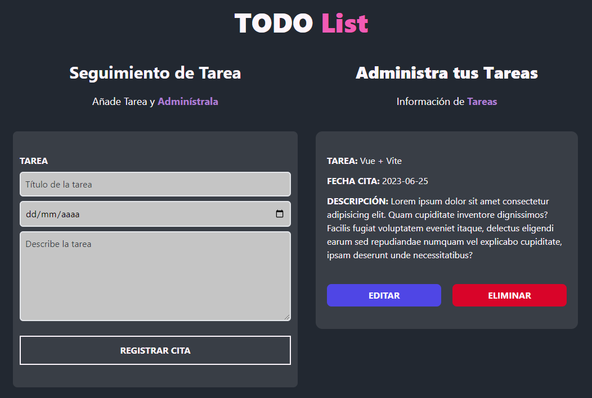

# Descripción del Proyecto

He desarrollado una aplicación web para administrar tareas utilizando Vue.js, Tailwind CSS y CSS personalizado.

En esta aplicación, utilicé las siguientes habilidades y tecnologías:

- **Vue.js**: Un framework de JavaScript para construir interfaces de usuario interactivas y reactivas.
- **Tailwind CSS**: Un framework de CSS que utilicé para diseñar y dar estilo a la interfaz de usuario de manera rápida y eficiente.
- **CSS personalizado**: Además de Tailwind CSS, también utilicé CSS personalizado para realizar cambios de estilo específicos. En este caso, utilicé CSS para cambiar de forma dinámica el color de texto en la interfaz.

- **Almacenamiento local**: Utilicé el almacenamiento local del navegador para guardar los datos de las tareas de manera persistente.
- **Componentes**: Desarrollé la interfaz de usuario dividiéndola en componentes reutilizables como encabezado, formulario y tarea.
- **Reactividad**: Utilicé la reactividad proporcionada por Vue.js para actualizar automáticamente la interfaz de usuario cuando se realizan cambios en los datos de las tareas.
- **Gestión de eventos**: Implementé la lógica para guardar, actualizar y eliminar tareas mediante la gestión de eventos.

**[Enlace a la página](https://todolist-yubalhh.netlify.app/)**

## Captura de pantalla

