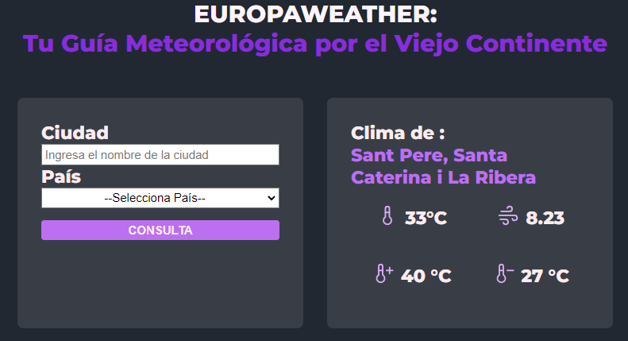

# Vue 3 + Vite

## EuropaWeather

Este repositorio contiene una aplicación llamada **EuropaWeather** escrita en Vue.js. Es una guía meteorológica para el continente europeo.

La aplicación consta de tres componentes principales:

- **Form**: Un formulario de búsqueda donde los usuarios pueden ingresar una ubicación para obtener el clima correspondiente.

- **Weather**: Muestra información detallada del clima para una ubicación específica, incluyendo temperatura actual, velocidad del viento y temperaturas máxima y mínima.

- **Alert**: Componente utilizado para mostrar mensajes de alerta o error en caso de problemas durante la obtención de los datos del clima.

Además, se utiliza un componente **Spinner** para mostrar un indicador de carga mientras se obtienen los datos del clima.

La funcionalidad de obtener los datos del clima y gestionar la lógica correspondiente se ha encapsulado en un hook personalizado llamado `useWeather`. Este hook importa las dependencias necesarias, como `ref`, `computed` y `axios`. Proporciona métodos y variables reactivas, como `getWeather` para obtener los datos del clima, `weather` para almacenar la información obtenida, `showWeather` para determinar si se debe mostrar la información del clima, `convertTemperature` para convertir la temperatura a grados Celsius, y `loading` y `error` para manejar el estado de carga y errores respectivamente.

**[Enlace a la página](https://weather-yubalhh.netlify.app/)**

## Captura de pantalla

