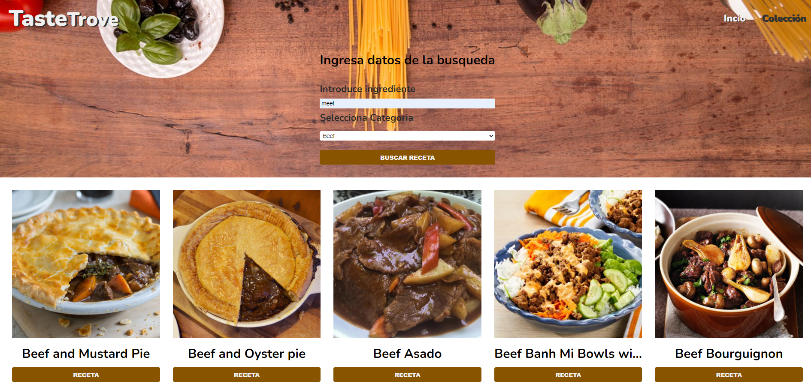

# TasteTrove

He desarrollado TasteTrove, una aplicación que brinda una experiencia interactiva y fluida a los usuarios. Implementé Vue Router para gestionar la navegación entre las diversas vistas, lo que garantiza una experiencia de usuario sin problemas.

En el desarrollo de los componentes, opté por utilizar el poderoso sistema de composición de Vue.js, `<script setup>`, que me permitió crear componentes de manera más concisa y legible. También hice uso de las directivas `v-if` y `v-for` para manejar de forma dinámica la presentación de datos y la generación de elementos de manera eficiente.

## Stores

Para gestionar el estado de la aplicación de forma eficiente, creé varios stores que utilizan la librería Pinia:

- **Meals Store**: Este store maneja el estado relacionado con las recetas culinarias. Incluye la lista de categorías, las recetas encontradas según los criterios de búsqueda proporcionados por el usuario y los detalles de una receta seleccionada. Las funciones dentro de este store, como `getMealRecipe()` y `selectMeal(id)`, permiten obtener y mostrar las recetas en la aplicación.

- **Collection Store**: En este store se gestiona la colección de recetas favoritas del usuario. Las funciones `addToCollection()` y `removeCollection()` permiten agregar y eliminar recetas de la colección. Además, `existInCollection(id)` verifica si una receta ya está en la colección. La propiedad `noneInCollection` proporciona información sobre si la colección está vacía o no.

- **Modal Store**: Este store controla el estado del modal que muestra los detalles de una receta seleccionada. La función `formatearIngredientes()` se encarga de dar formato a los ingredientes y cantidades para su visualización. La propiedad `textButton` proporciona el texto adecuado para el botón de agregar/eliminar receta de la colección.

- **Notification Store**: En este store, se gestiona el estado de las notificaciones flotantes y su contenido. La propiedad `show` indica si la notificación debe mostrarse o no, y `message` almacena el mensaje de la notificación.

## API Externa

Además de la gestión del estado, conecté la aplicación a una API externa utilizando la librería Axios para obtener datos actualizados sobre las recetas culinarias. Así, la información se recupera mediante llamadas HTTP y se almacena en los stores para un acceso rápido y eficiente.

En resumen, la combinación de Vue.js, Vue Router, Pinia y Axios me ha permitido desarrollar una aplicación web poderosa y efectiva, ofreciendo a los usuarios una experiencia excepcional. Los stores creados facilitan la gestión de datos y la interacción con la API, proporcionando una aplicación completa y bien estructurada.
**[Enlace a la página](https://tastetrove-yubalhh.netlify.app//)**

## Captura de pantalla

