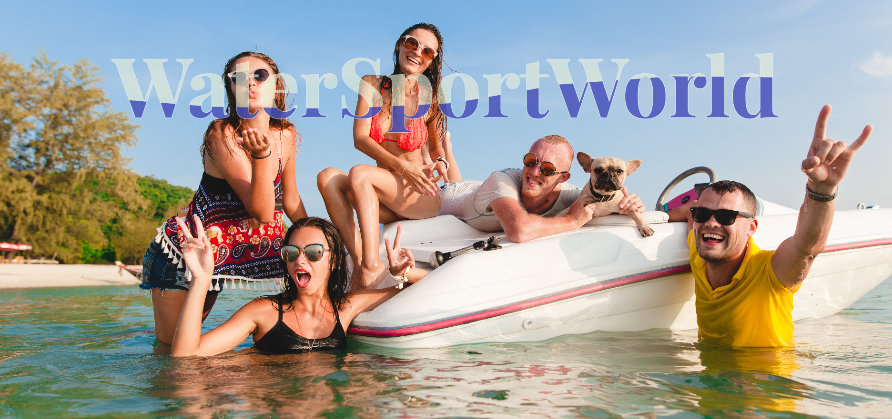

# 🚤 WaterSportWorld App 🏄

WaterSportWorld es una aplicación integral que combina un backend y frontend para gestionar reservas de actividades acuáticas. Aquí tienes una descripción general de los componentes clave del sistema.

## Backend 🛠️

### Tecnologías Utilizadas
- Node.js y Express para el servidor.
- MongoDB como base de datos.
- Mongoose para modelado de datos.
- Autenticación segura con bcrypt y JSON Web Tokens (JWT).
- Nodemailer para el envío de correos electrónicos.

### Comandos
- `npm start`: Inicia el servidor en producción.
- `npm run dev`: Inicia el servidor con nodemon para desarrollo.
- `npm run seed:import`: Importa datos de ejemplo a la base de datos.
- `npm run seed:destroy`: Elimina los datos de la base de datos.

## Frontend 🎨

### Tecnologías Utilizadas
- Vue.js como framework frontend.
- Vite como bundler para desarrollo rápido.
- Enrutamiento con vue-router.
- Manejo de estado con Pinia.
- Estilos con CSS para el diseño, PrimeVue y SweetAlert2.
- Comunicación con el backend a través de Axios.

### Comandos
- `npm run dev`: Inicia el servidor de desarrollo.
- `npm run build`: Genera una versión de producción.
- `npm run preview`: Previsualiza la versión de producción.

## Descripción 🌊
WaterSportWorld es una aplicación integral que gestiona reservas de actividades acuáticas, proporcionando una solución completa tanto en el backend como en el frontend. La aplicación facilita la reserva de servicios de deportes acuáticos y ofrece a los usuarios una experiencia fluida y agradable.

## Contenido 📋
- [Descripción](#descripcion)
- [Características](#caracteristicas)
- [Ejemplo](#ejemplo)
- [Instalación](#instalacion)
- [El Proceso](#el-proceso)
- [Recursos Útiles](#recursos-utiles)
- [Autores](#autores)

## Características Principales 🚀
- Registro e inicio de sesión seguro.
- Visualización de información de usuario.
- Reservas interactivas con selección de actividades.
- Gestión de servicios acuáticos.
- Navegación intuitiva entre secciones clave.

## Video Demostrativo 📹
Haz clic en la imagen para ver el video demostrativo.

## Instalación ⚙️
1. Clona este repositorio.
2. Configura el archivo `.env` con las variables necesarias (consulta el archivo `.env.example`).
3. Para el backend:
   - Ejecuta `npm install` para instalar las dependencias.
   - Ejecuta `npm run seed:import` para importar datos de ejemplo (opcional).
   - Ejecuta `npm run dev` para iniciar el servidor en modo de desarrollo.
4. Para el frontend:
   - Navega al directorio `frontend`.
   - Ejecuta `npm install` para instalar las dependencias.
   - Ejecuta `npm run dev` para iniciar el servidor de desarrollo.

## El Proceso 🛠️
WaterSportWorld se construyó utilizando tecnologías modernas, con un backend robusto en Node.js y Express, una base de datos MongoDB gestionada por Mongoose, y un frontend dinámico en Vue.js. La autenticación segura y las funciones CRUD se implementan de manera efectiva para ofrecer una experiencia de usuario confiable.

## Recursos Útiles 🛠️
- [Documentación de Vue.js](https://vuejs.org/)
- [Documentación de MongoDB](https://docs.mongodb.com/)

